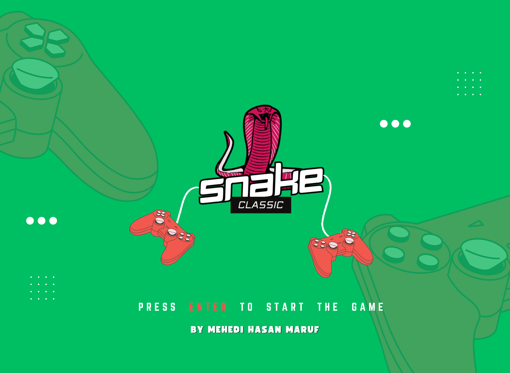
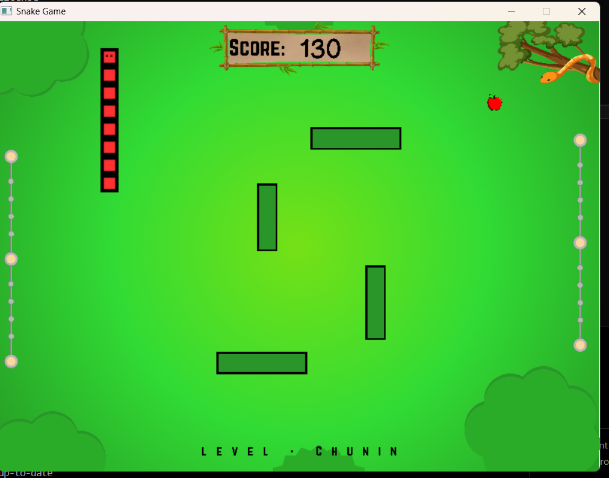
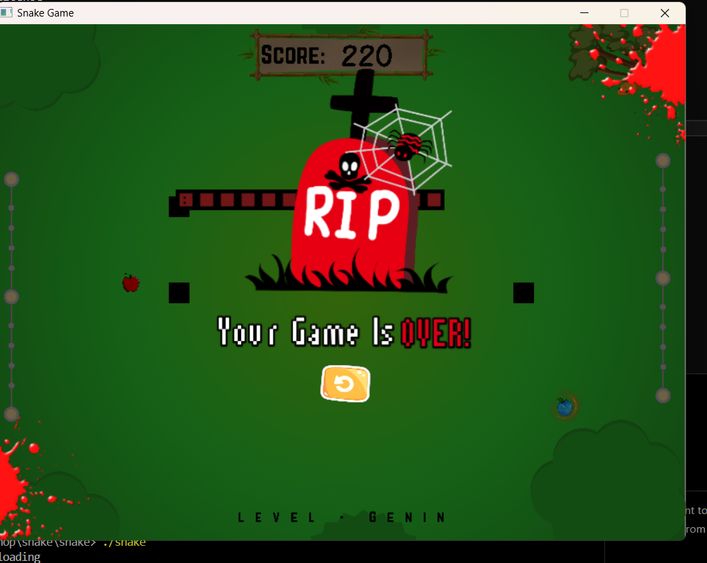
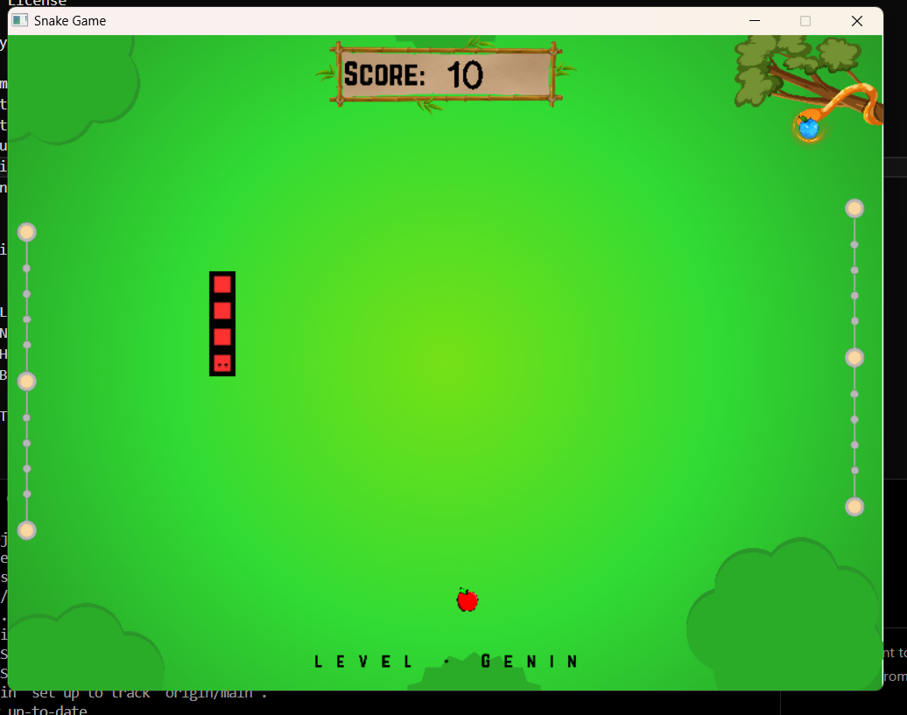

# Snake Classic 

Welcome to the Snake repository! This project is a modernized implementation of the classic Snake game using SDL2, featuring multiple levels, animations, and bonus mechanics. This documentation serves as a comprehensive guide for developers and contributors to understand, maintain, and enhance the game.



## Table of Contents
- [Project Overview](#project-overview)
- [Features](#features)
- [Setup and Installation](#setup-and-installation)
  - [For Windows (MinGW)](#for-windows-mingw)
  - [For Linux](#for-linux)
  - [For Mac](#for-mac)
- [How to Play](#how-to-play)
- [Game Mechanics](#game-mechanics)
- [File Structure](#file-structure)
- [Screenshots](#screenshots)
- [Known Issues](#known-issues)
- [Contributing](#contributing)
- [License](#license)
- [Contact](#contact)

---


## 🌟 Features
* 🐍 Classic Snake Gameplay: Control the snake, eat food, and grow longer.
* ⭐ Bonus Items: Randomly appearing bonus items for extra points.
* ⚠️ Moving Obstacles: Avoid dynamic obstacles while navigating the screen.
* 🎮 Responsive Controls: Smooth gameplay with keyboard input.
* 📈 High Scores: Automatically saves your best score.
* 🖼️ Interactive UI: Animated elements for a more engaging experience.
## 🛠️ Installation
### For Windows (MinGW)
1. Install MinGW and SDL2 development libraries for Windows.
2. Compile the game:
```bash

g++ -Isrc/include -Lsrc/lib -o snake snake.cpp -lmingw32 -lSDL2main -lSDL2 -lSDL2_image -lSDL2_ttf -lSDL2_mixer
```
3. Run the game:
``` bash
./snake
```
### For Linux
1. Install SDL2 libraries:
``` bash
sudo apt-get install libsdl2-dev libsdl2-image-dev libsdl2-ttf-dev libsdl2-mixer-dev
```
2. Compile the game:
``` bash
g++ -Isrc/include -Lsrc/lib -o snake snake.cpp -lSDL2 -lSDL2_image -lSDL2_ttf -lSDL2_mixer
```
Run the game:
```bash
./snake
```
### For Mac
1. Install SDL2 libraries:
``` bash

brew install sdl2 sdl2_image sdl2_ttf sdl2_mixer
```
2. Compile the game:
```
bash
Copy code
g++ -Isrc/include -Lsrc/lib -o snake snake.cpp -lSDL2 -lSDL2_image -lSDL2_ttf -lSDL2_mixer
```
3. Run the game:
```bash
./snake
```
## 🎮 How To Play

1. Use the arrow keys to move the snake:
  
  - ` ↑ ` Move up.
  - `↓` Move down.
  - `←` Move left.
  - `→` Move right.
2. Eat food to grow the snake and score points.
3. Avoid hitting moving obstacles and the snake’s own body.
4. Catch bonus items for extra points before they disappear!
## ⚙️ Game Mechanics
### 1. Food Placement
- Food appears randomly on the grid, ensuring it doesn’t overlap with the snake or obstacles.

- Bonus items have a 5% chance of spawning on each frame update.
### 2. Obstacles
Moving obstacles travel across the screen.
Colliding with an obstacle ends the game.
### 3. High Score
- The game automatically saves your highest score to high-score.txt.
- The score updates dynamically as you play.
### 3. Controls

| Key           | Action                  |
|---------------|-------------------------|
| **Arrow Up**  | Move snake up           |
| **Arrow Down**| Move snake down         |
| **Arrow Left**| Move snake left         |
| **Arrow Right**| Move snake right       |
| **SPACE**         | Pause the game          |
| **SPACE**         | Resume the game         |
| **ESC**       | Quit the game           |


## 📁 File Structure
```
bash
snake-game/
├── src/              # Source code files
├── assets/           # Game assets like sounds and textures
├── high-score.txt    # Stores the highest score
├── README.md         # Project documentation
├── .gitignore        # Ignored files
```
Screenshots
Main Game Screen
> **💡 NOTE**  
> Minor lag on older systems when rendering multiple moving objects.


>Bonus items sometimes overlap with obstacles in rare scenarios.
## 🚀 Contributing
Feel free to contribute to this project! Here's how:

1. Fork the repository.
2. Create a new branch:
``` bash

git checkout -b feature-name
``` 
3. Make your changes and commit:
``` bash
git commit -m "Add feature-name"
```
4. Push your branch and submit a Pull Request.

## ⚖️License

[MIT](https://github.com/maruf6890/snake/blob/main/LICENSE)


## 📧 Contact

For feedback or questions, feel free to reach out:

- Email:  maruf6890@gmail.com
- GitHub: maruf6890


## 🖼️ Screenshots






## Project Video